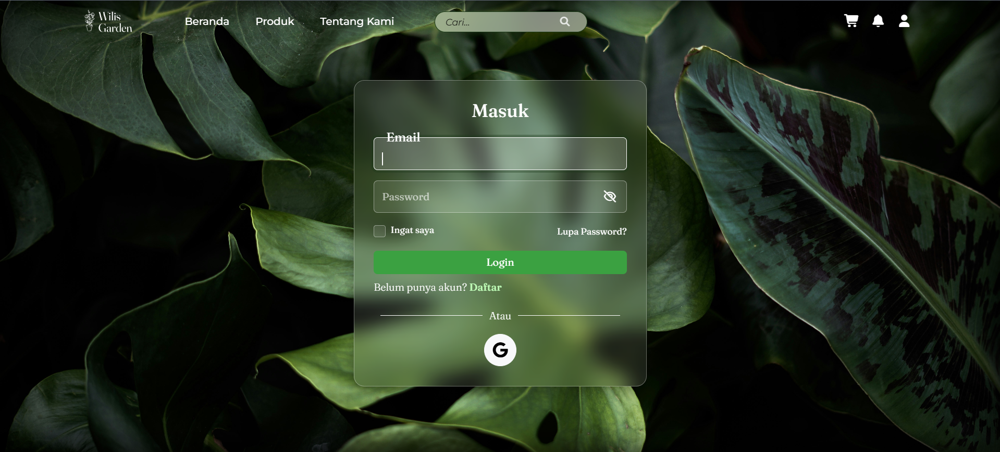
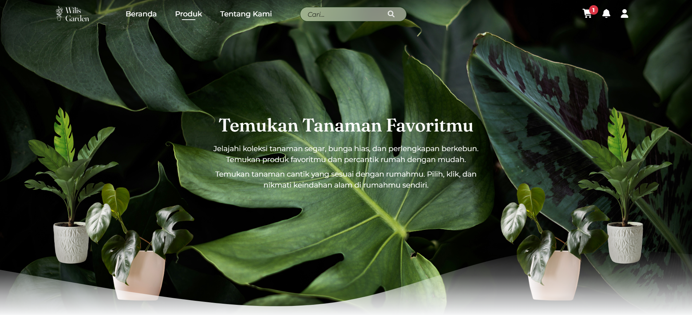
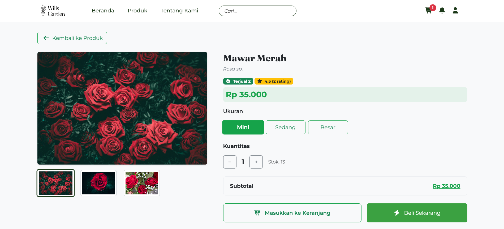
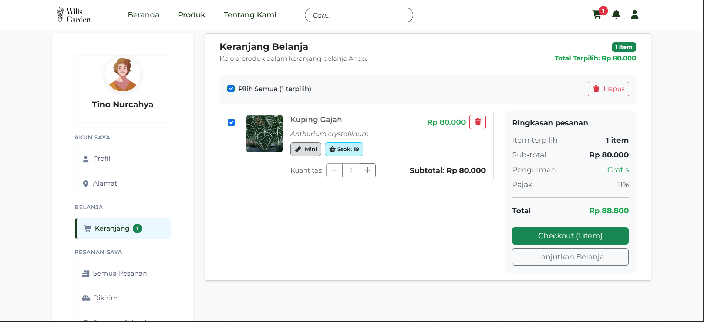

# 🌸 Toko Bunga Wilis

Website **e-commerce toko bunga & tanaman** berbasis **Laravel** yang memungkinkan pengguna mencari, memilih, dan membeli tanaman secara online, lengkap dengan sistem keranjang, checkout, simulasi pembayaran, ulasan produk, serta dashboard admin.

🔗 Repository: https://github.com/TinoNurcahya/proyek2-toko-bunga-wilis

---

## 📌 Deskripsi Proyek
**Toko Bunga Wilis** adalah website penjualan tanaman bunga yang dibangun untuk memenuhi kebutuhan proyek perkuliahan (Proyek 2).  
Aplikasi ini memiliki **2 role pengguna (Admin & User)** dan dilengkapi dengan berbagai fitur modern seperti login Google, animasi interaktif, dan simulasi pembayaran online.

---

## 👥 Role Pengguna
### 🔹 User
- Registrasi & login (Laravel Breeze)
- Login menggunakan akun Google
- Melihat daftar tanaman
- Mencari tanaman
- Melihat detail tanaman
- Menambahkan produk ke keranjang
- Mengubah jumlah produk di keranjang
- Checkout & mengisi data pemesanan
- Simulasi pembayaran menggunakan **Midtrans (Sandbox)**
- Melihat riwayat pesanan
- Membuat, mengedit, dan menghapus ulasan produk
- Mengubah data profil pengguna

### 🔹 Admin
- Login admin
- Dashboard admin menggunakan **AdminLTE**
- Manajemen produk (CRUD)
- Melihat & mengelola pesanan
- Mengelola ulasan produk
- Mengelola data user

---

## ✨ Fitur Utama
- Autentikasi menggunakan **Laravel Breeze**
- Login Google (OAuth)
- Sistem keranjang belanja
- Checkout & simulasi pembayaran (Midtrans)
- Review / ulasan produk
- Dashboard admin (AdminLTE)
- Animasi scroll (**AOS**)
- Parallax effect (**Rellax**)
- Slider / carousel (**Swiper.js**)
- Galeri gambar (**PhotoSwipe**)
- Form kontak menggunakan **Formspree**
- Responsive design (Bootstrap)
- Ikon menggunakan **Font Awesome**

---

## 🛠️ Teknologi yang Digunakan
- **PHP >= 8.3**
- **Laravel**
- Laravel Breeze
- MySQL
- Bootstrap
- Font Awesome
- AdminLTE
- Swiper.js
- AOS
- Rellax
- PhotoSwipe
- Midtrans (Sandbox)
- Formspree
- NPM / Node.js

---

## ⚙️ Instalasi & Menjalankan Project

### 1️⃣ Clone Repository
```bash
git clone https://github.com/TinoNurcahya/proyek2-toko-bunga-wilis.git
cd proyek2-toko-bunga-wilis
```
### 2️⃣ Install Dependency Backend
```bash
composer install
```
### 3️⃣ Install Dependency Frontend
```bash
npm install
```
### 4️⃣ Konfigurasi Environment
```bash
cp .env.example .env
php artisan key:generate
```
#### Atur database dan konfigurasi lain di file .env:
```bash
DB_CONNECTION=mysql
DB_HOST=127.0.0.1
DB_PORT=3306
DB_DATABASE=proyek2_toko_bunga_wilis
DB_USERNAME=root
DB_PASSWORD=
```
#### 5️⃣ Migrasi Database dan seeder
```bash
php artisan migrate --seed
```
##### Compile Asset dan Jalankan Server
```bash
npm run dev
php artisan serve
```

## 🖼️ Preview Aplikasi (Screenshot)

Aplikasi ini **belum di-deploy ke hosting**, sehingga preview tampilan website disediakan dalam bentuk **screenshot**.

📁 Seluruh screenshot UI aplikasi tersedia di folder:

> 📁 Folder: **docs/**

Screenshot yang tersedia meliputi:
- Login & Registrasi
- Homepage
- Daftar & Detail Produk
- Keranjang & Checkout
- Simulasi Pembayaran
- Profil & Alamat User
- Riwayat Pesanan
- Rating & Ulasan Produk
- Notifikasi dan halaman pendukung lainnya

Silakan membuka folder tersebut untuk melihat **preview lengkap tampilan aplikasi**.

### Alur Penggunaan Aplikasi
1. User login atau registrasi
   

2. User melihat daftar produk
   

3. User melihat detail produk
   

4. User checkout dan pembayaran
   